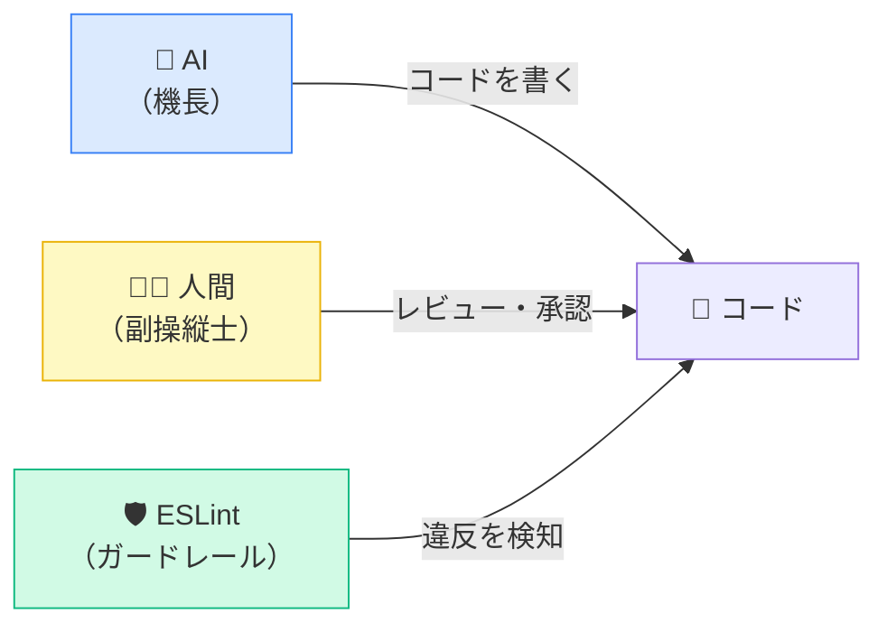
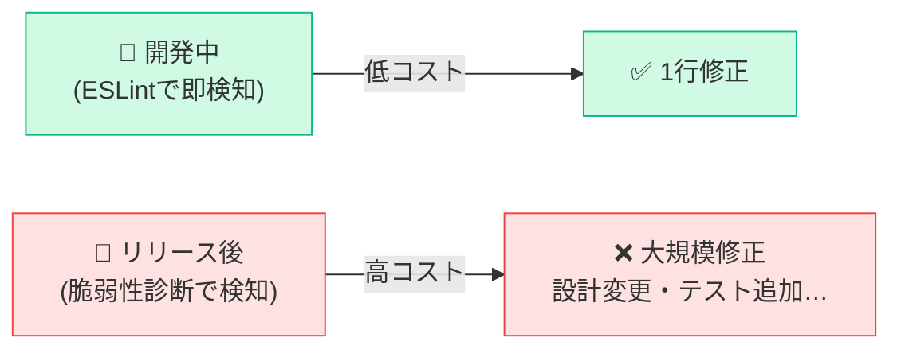
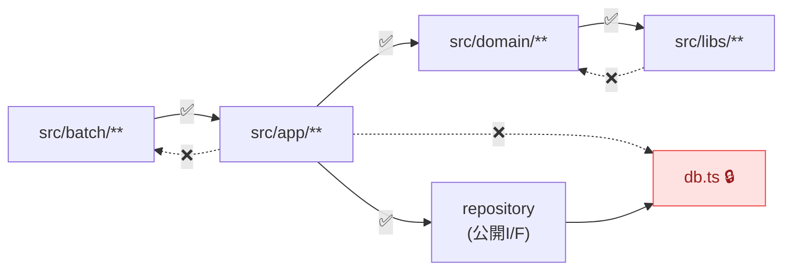
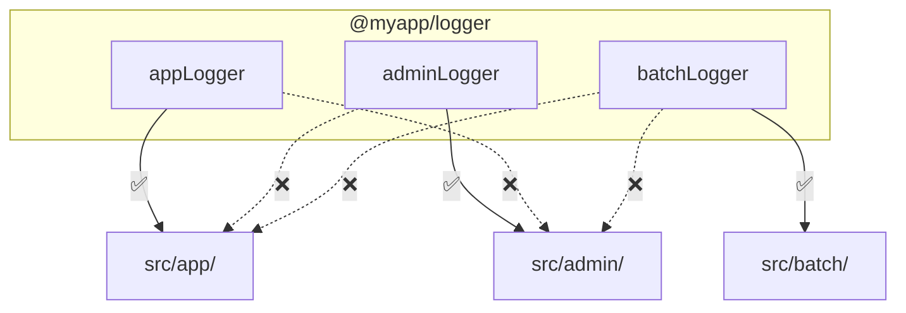

# 生成AIでTSを扱うときに設定しておきたい ESLint (plugin) ルール

---
layout: default
---

## はじめに

<div class="grid grid-cols-2 gap-8 mt-4 items-center">
<div>

今や操縦席に座っているのはコーディングエージェントです。<br/><br/>

しかし操縦席に座っているのがAIであれ人間であれ、<u>開発者はルールに違反しないようコードを書くべき</u>です。<br><br>

その手段として、静的解析ツールによるガードレールは今も変わらず有効だと考えています。<br><br>

コードを書く方もレビューする方も気づかなかった問題をガードしてくれるからです。

</div>
<div>



</div>
</div>

---
layout: default
---

## 今日お話しすること

| プラグイン | 主な効果 |
|---|---|
| `eslint-plugin-security` | セキュリティ脆弱性の早期検知 |
| `eslint-plugin-unicorn` | ファイル名規則の統一 |
| `@typescript-eslint/naming-convention` | 命名規則の統一 |
| `eslint-plugin-import` | import順序・依存方向の管理 |
| `no-restricted-imports` / `no-console` | 意図しないimport・ログの防止 |
| `eslint-plugin-jsdoc` | ドキュメントの品質向上 |
| `@vitest/eslint-plugin` | テストコードの品質向上 |

<div class="mt-4"></div>

10分という限られた時間で、できるだけたくさん紹介します。

---
layout: default
---

## eslint-plugin-security

<div class="mt-4 mb-8">
セキュリティ的にまずい書き方を検知するルール集です。
</div>

| ルール | 禁止する書き方 | 防ぐ脆弱性 |
|---|---|---|
| detect-eval-with-expression | eval(変数) | 任意コード実行 |
| detect-child-process | exec(変数) | OSコマンドインジェクション |
| detect-possible-timing-attacks | `==` でトークン比較 | タイミング攻撃 |
| detect-unsafe-regex | 爆発的バックトラック正規表現 | ReDoS |
| detect-non-literal-fs-filename | fs.readFile(変数) | ディレクトリトラバーサル |

---
layout: default
---

## eslint-plugin-security — なぜ開発中に検知すべきか

<div class="mt-8 mb-16">

</div>

検知が**遅れるほど修正コストは増大**します。

---
layout: default
---

## eslint-plugin-unicorn / filename-case

ファイル名の命名規則を強制するルールです。

<div class="mt-4"></div>

```typescript
rules: {
  'unicorn/filename-case': [
    'error',
    {
      cases: {
        kebabCase: true,
      },
    },
  ],
},
```

<div class="mt-4"></div>

| NG | OK |
|---|---|
| `UserService.ts` | `user-service.ts` |
| `useAuthHook.ts` | `use-auth-hook.ts` |

---
layout: default
---

## @typescript-eslint/naming-convention

| 対象 | フォーマット | 備考 |
|---|---|---|
| 変数 | `camelCase` / `UPPER_CASE` | 定数は `UPPER_CASE` |
| 関数 | `camelCase` | |
| パラメータ | `camelCase` | 未使用は `_` prefix 許可 |
| boolean 変数 | `PascalCase` | `is` / `has` / `should` / `can` / `will` prefix 強制 |
| クラス・interface・type | `PascalCase` | |
| interface | `PascalCase` | `I` prefix **禁止**（`IUser` → `User`） |
| enum メンバー | `PascalCase` | |

---
layout: default
---

## @typescript-eslint/naming-convention — 設定例

```typescript
'@typescript-eslint/naming-convention': [
  'error',
  { selector: 'variable', format: ['camelCase', 'UPPER_CASE'] },
  { selector: 'function', format: ['camelCase'] },
  { selector: 'parameter', format: ['camelCase'], leadingUnderscore: 'allow' },
  {
    selector: 'variable', types: ['boolean'],
    format: ['PascalCase'], prefix: ['is', 'has', 'should', 'can', 'will'],
  },
  { selector: 'typeLike', format: ['PascalCase'] },
  {
    selector: 'interface', format: ['PascalCase'],
    custom: { regex: '^I[A-Z]', match: false },
  },
  { selector: 'enumMember', format: ['PascalCase'] },
  {
    selector: 'memberLike', modifiers: ['private'],
    format: ['camelCase'], leadingUnderscore: 'require',
  },
],
```

---
layout: default
---

## eslint-plugin-import

`import` 関連のコード品質を保つルール集です。


<div class="mb-4"></div>

| ルール | 効果 |
|---|---|
| import/order | グループ別に順序を定義・空行を強制 |
| import/no-duplicates | 同一モジュールの重複 import を禁止 |
| import/newline-after-import | import ブロック後の空行を強制 |
| import/no-restricted-paths | モジュール間の依存方向を強制 |

---
layout: default
---

## eslint-plugin-import (import/order)

```typescript
'import/order': ['error', {
  groups: [
    'builtin',  // fs, path など
    'external', // npm packages
    'internal', // @myapp/* など
    'parent',   // ../
    'sibling',  // ./
    'index',    // index ファイル
    'type',     // type imports
  ],
  'newlines-between': 'always',
  alphabetize: { order: 'asc', caseInsensitive: true },
}]
```

---
layout: default
---

## eslint-plugin-import (no-duplicates & newline-after-import)

```typescript
// ❌ NG: 重複import
import { foo } from './mod';
import { bar } from './mod';
const x = foo();

// ✅ OK: まとめてimport、後に空行
import { foo, bar } from './mod';

const x = foo();
```

---
layout: default
---

## eslint-plugin-import (no-restricted-paths)

<u>モジュラーモノリスのアーキテクチャ境界保護</u>に有効です。

<div class="mb-8"></div>



---
layout: default
---

## eslint-plugin-import (no-restricted-paths) 設定例

```typescript
'import/no-restricted-paths': ['error', {
  zones: [
    {
      target: './src/app/**/*',
      from: './src/batch/**',
      message: 'app cannot import from batch.',
    },
    {
      target: './src/libs/**/*',
      from: './src/domain/**/*',
      message: 'libs cannot depend on domain.',
    },
    {
      target: './src/!(infra)/**/*',
      from: './src/infra/db.ts',
      message: 'Use repository interface instead of importing db.ts directly.',
    },
  ],
}]
```

---
layout: default
---

## ESLintコアルール (no-restricted-imports)

特定 export の import を禁止します。**ACL層別使い分け**などに有効です。

<div class="mb-8"></div>



---
layout: default
---

## ESLintコアルール (no-restricted-imports) 設定例

```typescript
// src/app/**/*.{ts,tsx} に適用
'no-restricted-imports': ['error', {
  paths: [{
    name: '@myapp/logger',
    importNames: ['adminLogger', 'batchLogger', 'workerLogger'],
    message: 'app layer can only import appLogger.',
  }],
}],
```

```typescript
// ✅ OK
import { appLogger } from '@myapp/logger';

// ❌ NG
import { batchLogger } from '@myapp/logger';
```

---
layout: default
---

## ESLintコアルール (no-console)

本番コードへの `console.log` 混入防止に有効です。`allow` で特定メソッドのみ許可できます。

<div class="mb-8"></div>

```typescript
'no-console': ['error', { allow: ['warn', 'error'] }]
```

<div class="mb-8"></div>

| | メソッド |
|---|---|
| ❌ NG | `console.log()` `console.debug()` |
| ✅ OK | `console.warn()` `console.error()` |

---
layout: default
---

## eslint-plugin-jsdoc

関数・クラス・メソッドへの JSDoc 付与を促進します。

<div class="mb-8"></div>

- `files` / `ignores` で**特定ファイルのみ**有効化できる
- 既存プロジェクトは `warn` で段階的導入、新規は `error` でOK

<div class="mb-8"></div>

```typescript
// ❌ NG
const greet = (name: string): string => `Hello, ${name}`;

// ✅ OK
/**
 * 挨拶文を返す
 * @param name - 対象の名前
 * @returns 挨拶文字列
 */
const greet = (name: string): string => `Hello, ${name}`;
```

---
layout: default
---

## @vitest/eslint-plugin

Vitestのテストコード品質を保つルール集です。

<div class="mb-8"></div>

| ルール | 効果 |
|---|---|
| consistent-test-it | `it` / `test` を統一 |
| no-conditional-xxx 系 | テスト内の条件分岐を禁止 |
| prefer-mock-promise-shorthand | `mockResolvedValue` / `mockRejectedValue` を強制 |
| require-to-throw-message | `toThrow` にエラーメッセージの検証を強制 |
| require-top-level-describe | `describe` のネスト数を制限 |

---
layout: default
---

## まとめ

AIであれ人間であれ、開発者が守るべきガードレールとしてESLintルールを活用しましょう。

<div class="mb-8"></div>

| プラグイン | 主な効果 |
|---|---|
| `eslint-plugin-security` | セキュリティ脆弱性の早期検知 |
| `eslint-plugin-unicorn` | ファイル名規則の統一 |
| `@typescript-eslint/naming-convention` | 命名規則の統一 |
| `eslint-plugin-import` | import順序・依存方向の管理 |
| `no-restricted-imports` / `no-console` | 意図しないimport・ログの防止 |
| `eslint-plugin-jsdoc` | ドキュメントの品質向上 |
| `@vitest/eslint-plugin` | テストコードの品質向上 |

---
layout: default
---

## おわりに

面白いことに、AIが進化してくれたおかげで**自分が欲しいESLintのルールをAIに作らせること**も以前より簡単になりました。<br/><br/>

自分はHonoやUnJSのESLint Pluginを自作しています（よかったら ⭐️Star⭐️ をください...！！）。

<div class="mt-8"></div>

- <u>eslint-plugin-hono</u>
  -  https://github.com/ysknsid25/eslint-plugin-hono
- <u>eslint-plugin-citty</u>
  -  https://github.com/ysknsid25/eslint-plugin-citty

<div class="mt-8"></div>

<u>自チームの状況に合わせて、みなさんもぜひESLint Pluginを自作してみてはいかがでしょうか？</u>

---
layout: ending
---
